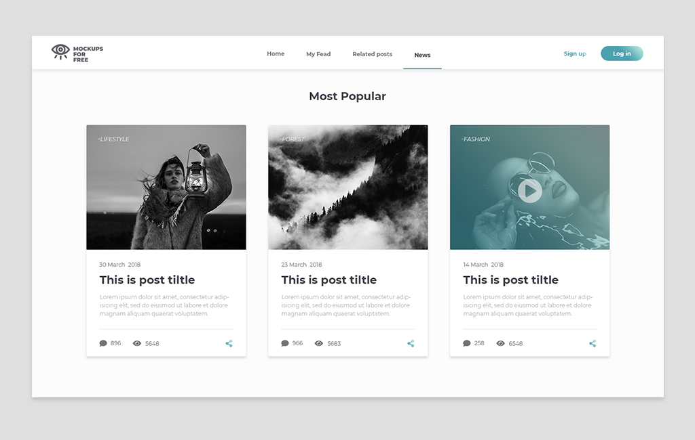
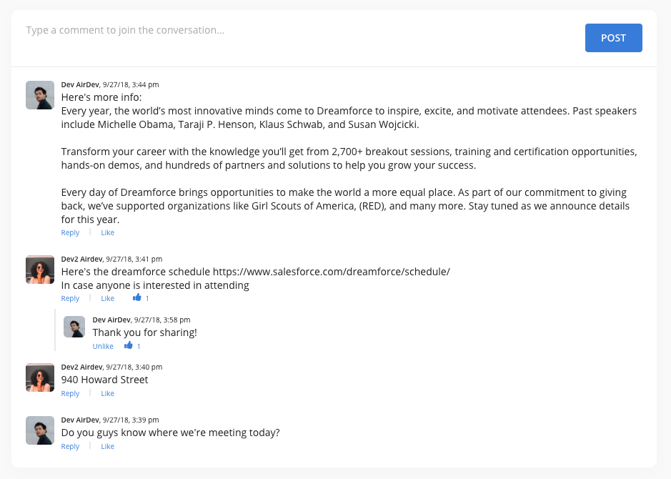

### Django APIs for Blog

_Don't bother about UIs, we're here for APIs_,
Here you need to identify the schema/model fields by observing the UIs, The goal of this assignment is to build **_API_** for a **_blog_** site in which you are free to play with as much as possible your sample data.

### API Features:

1. Authentication

- Login
- Logout
- Signup

2. Users

- A user can able to see their profile.

3. Posts

- A user can Create, Delete, Get a list all the Posts,
- Get single post with all the comments with likes counts

4. Comments

- Comments in a post.
- Comments in particular comment.

5. Likes

- Likes in a post.
- Likes in a comment

### Coding Guidelines

- Please fork current problem repository or use it as template and, add [@bhar4t](https://github.com/bhar4t), [@lokendra-smilebots](https://github.com/lokendra-smilebots) as collaborator while intializing repository in github. and follow the given timeline instructions from your mail.
- The changes/commits will not be considered after timeline mentioned in your mail.
- Please avoid any frameworks and libraries except **_Django REST framework_**.
- Focus more on the **_Django REST framework_** side of the problem.
- You will be evaluated on
  - Modularity of Code
  - Security
  - Data Structures used
  - Model serialization
  - Database designing
  - Logic and cleanliness of code.
  - Completeness.
- Please ask us for any hurdle in your problem assignment.
